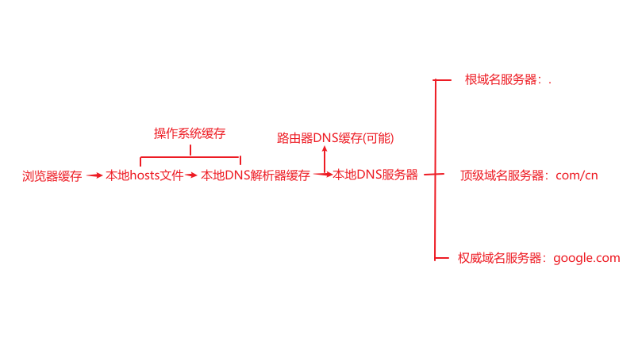
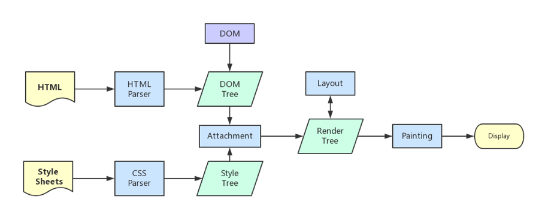

## 前言

最近在准备秋招，网上关于这道经典问题的文章特别多，看了很多大佬的文章后打算自己也总结下。

叠个甲：本篇较多内容来自网络大佬文章。但是因为文章比较多，部分知识/观点的参考网站可能没有在最后贴出，如果有大佬发现的话请联系我添加。或者不允许转载我会马上处理下的。

开始前我再谈谈我对这道面试题的想法。我个人认为这是一道好题。因为这道题覆盖的知识面很广，广的可以没有边界。比如通过层层推演一直讲到操作系统底层或者更深(在学习过程中有几位大佬就从 url 讲到了操作系统)。我的感觉是震惊+喜悦的，从知识边界往外探索的感觉很爽。但是我目前的技术能力无法全部理解(前端菜鸟)。所以本篇的整理是到我目前的知识边界的。

另外，**从这道题出发，对前端体系知识的扩展(甚至是对计算机体系知识)才是我认为应该学习的东西，由点到面**。所以本文会有大量的思考拓展，主要的形式是抛出一些问题(发现问题也是学习过程中重要的一环)，交给大家去思考。**特别建议你在评论区发表出你对一些问题/观点/知识的看法/补充/改正**。这样的碰撞也是很关键的一环。

## 思路

我将**输入 URL 到网页显示，发生了什么**的过程大体分为 3 个阶段，而每个大阶段下又分了几个关键节点：

1. 浏览器发起请求阶段
   - 1.1 URL 解析
   - 1.2 缓存检查
   - 1.3 DNS 寻址

2. 网络通信阶段
   - 2.1 建立 TCP 连接（三次握手）
   - 2.2 TLS 握手（HTTPS）
   - 2.3 客户端发起 HTTP 请求
   - 2.4 网络传输
   - 2.5 服务器端处理
   - 2.6 服务器返回响应（含重定向处理）
   - 2.7 断开 TCP 连接（四次挥手）

3. 浏览器处理响应阶段
   - 3.1 浏览器获取响应及预处理
   - 3.2 浏览器渲染 HTML

---

## 浏览器发起请求

### 1.1 URL 解析

&emsp;&emsp;当用户开始在导航栏上面输入内容时，浏览器 Browser 进程的 UI 线程开始**处理输入**，UI 线程判断输入的是 URL 地址还是搜索关键字，是搜索关键字就发送给浏览器默认搜索引擎，是 URL 地址就开始 URL 解析（一般是通过协议、域名、路径等确定服务器地址）。

_思考_

1. `UI线程判断输入的是URL地址还是搜索关键字` 是否是即时的？目的是什么？
2. `浏览器Browser进程的UI线程` 现代浏览器的基本架构？进程与线程的关系？

### 1.2 缓存检查

&emsp;&emsp;URL 解析完成后，在发起任何网络请求之前，浏览器会先进行缓存检查。这一步发生在 DNS 寻址之前，因为一旦命中强缓存，后续的 DNS 解析、TCP 连接、HTTP 请求都不需要发生。

**Service Worker 缓存**

如果页面注册了 Service Worker，浏览器会优先让 Service Worker 拦截请求。Service Worker 可以自主决定从缓存中返回资源，还是放行请求到网络。这一层优先级最高。

**强缓存**

浏览器根据响应头的 `Expires` 和 `Cache-Control` 判断是否命中强缓存。如果命中且未过期，直接从本地缓存获取资源，**不会发送任何网络请求**。如果没有命中，则进入下一步。

**协商缓存**

没有命中强缓存时，浏览器会发送请求，并在请求头中携带 `If-Modified-Since` 和 `If-None-Match`，由服务器判断资源是否有变化。如果服务器返回 304，则从本地缓存获取资源；如果返回 200，则使用服务器返回的新资源。

_缓存优先级总结：Service Worker > 强缓存 > 协商缓存 > 直接请求_

### 1.3 DNS 寻址

&emsp;&emsp;缓存未命中后，当用户按下回车键，UI 线程会通知网络线程初始化一个网络请求，进而**开始导航**，这时候 tab 标签页上会展示一个提示资源正在加载中的旋转圈圈。网络线程首先进行 DNS 寻址，将域名转换为服务器 IP 地址。

**DNS 寻址**的主要目的是把 URL 地址转为服务器 IP 地址。这其中会有一个 DNS 缓存查找过程：

如图所示

_思考_

1. `UI线程会通知网络线程` 线程间通信？（这里至少有三个问题哦！）
2. `网络线程` 网络线程与网络进程？
3. 初次请求和二次请求后哪些地方会对 DNS 进行缓存？（DNS缓存查找顺序：浏览器缓存 → 操作系统缓存 → hosts 文件 → 本地 DNS 服务器 → 递归查询根域名服务器）

---

## 网络通信

### 2.1 建立 TCP 连接（三次握手）

&emsp;&emsp;DNS 寻址完成，获取到服务器 IP 后，客户端开始与服务器建立 TCP 连接。

**第一步**：客户端发送 SYN 包给服务端。

- 客户端将序列号（Sequence Number）设为一个随机数 A，同时将标志位 SYN 置为 1，表示请求建立连接。
- 客户端进入 SYN_SENT 状态，并等待服务端的响应。

**第二步**：服务端收到 SYN 包后，回复 SYN+ACK 包给客户端。

- 服务端将序列号设为一个随机数 B，同时将标志位 SYN 和 ACK 置为 1，表示接受客户端的请求，同时确认客户端的序列号。
- 服务端将确认序列号（Acknowledgment Number）设为客户端的序列号加 1（即 A+1）。
- 服务端进入 SYN_RCVD 状态。

**第三步**：客户端收到服务端的 SYN+ACK 包后，回复一个 ACK 包给服务端。

- 客户端将确认序列号设为服务端的序列号加 1（即 B+1）。
- 客户端将标志位 ACK 置为 1，表示对服务端的响应。
- 客户端进入 ESTABLISHED 状态，服务端收到此 ACK 后也进入 ESTABLISHED 状态，连接建立完成。

_思考_

1. 为什么是三次握手？而不是两次或四次？
2. 如果已经建立连接，客户端突然出现故障怎么办？

### 2.2 TLS 握手（HTTPS）

&emsp;&emsp;如果是 HTTPS 协议，在 TCP 三次握手完成后，还需要进行 TLS 握手以建立加密通信信道。

> 注意：TLS 1.2 需要 2-RTT（约4个步骤），TLS 1.3 已优化为 1-RTT，不应笼统称为"四次握手"。

以 TLS 1.2 为例，大概流程：

1. **Client Hello**：客户端发送支持的 TLS 版本、加密套件列表、随机数等。
2. **Server Hello**：服务端选定加密套件，返回证书、随机数等。
3. **客户端验证证书**：客户端验证服务端证书的合法性，生成预主密钥（Pre-Master Secret），用服务端公钥加密后发送，并最终生成对称加密密钥（Session Secret）。
4. **服务端生成密钥**：服务端用私钥解密预主密钥，同样生成 Session Secret，双方握手完成，后续通信使用对称加密。

_思考_

1. SSL 和 TLS 的关系？（注意：是 TLS，不是 TSL）

### 2.3 客户端发起 HTTP 请求

&emsp;&emsp;TCP 连接（及 TLS 握手）完成后，客户端构建 HTTP 报文，通过**应用层**协议（HTTP/HTTPS）封装后发送给服务器。

### 2.4 网络传输

&emsp;&emsp;应用层的 HTTP 报文向下经过各层协议封装后在网络中传输。根据网络参考模型，传输层（TCP）之下还有网络层（IP 数据报）、数据链路层（帧）、物理层（实际信号传输）。

_思考_

关于七层网络参考模型（OSI模型）与四层模型（TCP/IP模型）的区别与关系？

### 2.5 服务器端处理

&emsp;&emsp;服务器接收请求，经过负载均衡、鉴权、业务逻辑处理等步骤后，生成 HTTP 响应报文。

### 2.6 服务器返回响应（含重定向处理）

&emsp;&emsp;服务器将响应发回客户端，网络线程接收响应头后，**在响应头阶段**即根据 `Content-Type` 等信息开始判断 MIME 类型，而不是等全部数据接收完毕。

**重定向处理**

如果服务器返回的是 **HTTP 301/302 重定向响应**，网络线程会告知 UI 线程进行地址跳转，由 UI 线程更新地址栏，再通知**网络线程**重新发起一个新的网络请求（从 DNS 寻址开始重新走一遍流程）。

> 重定向是服务器响应的结果，必然发生在 TCP 连接建立、HTTP 请求发出之后，不可能在 DNS 寻址阶段就收到。

### 2.7 断开 TCP 连接（四次挥手）

&emsp;&emsp;HTTP/1.1 默认支持长连接（`Connection: keep-alive`），不必每次请求都重新握手和挥手，连接会在空闲超时后才关闭。以下是四次挥手的完整流程：

**第一步**：客户端发送 FIN 包给服务端。

- 客户端将标志位 FIN 置为 1，表示请求断开连接。
- 客户端进入 FIN_WAIT_1 状态。

**第二步**：服务端收到 FIN 包后，发送 ACK 包给客户端。

- 服务端将标志位 ACK 置为 1，确认客户端的 FIN 包。
- 服务端进入 CLOSE_WAIT 状态。
- 客户端收到 ACK 后进入 FIN_WAIT_2 状态，等待服务端发送自己的 FIN 包。

**第三步**：服务端数据发送完毕后，发送自己的 FIN 包给客户端。

- 服务端将标志位 FIN 置为 1，表示自己也准备断开连接。
- 服务端进入 LAST_ACK 状态。

**第四步**：客户端收到服务端的 FIN 包后，回复 ACK 包。

- 客户端将标志位 ACK 置为 1，确认服务端的 FIN 包。
- 客户端进入 TIME_WAIT 状态，等待 2MSL 时间后彻底关闭连接（防止最后一个 ACK 丢失）。

_思考_

1. 为什么握手三次，挥手却需要四次？
2. TIME_WAIT 状态为什么要等待 2MSL？

---

## 浏览器处理响应

### 3.1 浏览器获取响应及预处理

&emsp;&emsp;浏览器**网络线程**在接收到响应头时即开始处理（流式处理，不等响应体全部到达）。根据 HTTP 头部的 `Content-Type` 判断 MIME 类型：

- 是 HTML 文件 → 通知**渲染进程**准备渲染
- 是压缩文件（如 zip）→ 交给下载管理器处理
- 是其他资源（图片、JS、CSS 等）→ 由相应引擎处理

网络线程完成解析后将数据转发给**浏览器进程**，再由浏览器进程通知渲染进程开始工作。

### 3.2 浏览器渲染

&emsp;&emsp;_ps：进入前端领域！_

注：**GUI 渲染线程与 JS 引擎线程互斥**，两者不能同时工作。

**GUI 渲染线程**

渲染的完整流程如下：

1. **构建 DOM 树**：HTML 解析器解析 HTML，流程为：
   字节 → 字符 → Token（令牌）→ Node（节点）→ DOM 树

2. **构建 CSSOM 树**：解析 CSS，生成 CSSOM 树。
   CSS 选择器的**匹配**方向是从右到左（注意：这是选择器匹配的方向，不是 CSS 文件解析的方向）。

3. **生成 Layout Tree（布局树）**：合并 DOM 树和 CSSOM 树，生成布局树（早期称为 Render 树，现代 Chrome 已使用 Layout Tree 等概念替代）。display:none 的节点不会出现在布局树中。

4. **分层（Layer）**：浏览器根据特定规则（如 will-change、position、opacity 等）将页面分为多个图层。**分层发生在绘制之前。**

5. **布局（Layout/Reflow重排）**：计算布局树中各元素的尺寸和位置。

6. **绘制（Paint/Repaint重绘）**：为每个图层生成绘制指令，描述如何绘制该层的像素信息。

7. **光栅化（Rasterize）**：合成线程将图层切分为图块（Tiles），由光栅化线程将图块转化为位图。

8. **合成与显示（Composite）**：浏览器将各图层的位图信息发送给 GPU，GPU 合成后显示在屏幕上。

经典图

**JS 引擎线程**

&emsp;&emsp;当 HTML 解析器遇到 `<script>` 标签时，会暂停 GUI 渲染线程，转由 JS 引擎线程执行脚本，执行完毕后再恢复渲染。

> 补充：浏览器有**预加载扫描器（Preload Scanner）**，它在主线程被 JS 阻塞时，仍可在后台继续扫描 HTML，提前发起对后续图片、CSS、脚本等资源的加载请求，从而减少整体渲染耗时。

_思考_

1. `GUI渲染线程与JS引擎线程互斥` 为什么这样设计？
2. `async` 和 `defer` 属性如何改变 JS 的加载和执行时机？
3. 从这里可以延伸出 JS 的更多内容：V8 引擎原理、JS 执行上下文、事件循环机制、垃圾回收机制，敬请期待后续整理。

---

## 站在巨人的肩上

本文很多观点/知识都来源于互联网上的前辈大佬们的文章，感谢 🍑🍑🍑

如果文中有误，还望指出。

https://zhuanlan.zhihu.com/p/102149546

https://juejin.cn/post/6844903574535667719#heading-16

https://juejin.cn/post/6935232082482298911?searchId=202308211925443A86748DAA5DDDD77716#heading-44

https://zhuanlan.zhihu.com/p/80551769
